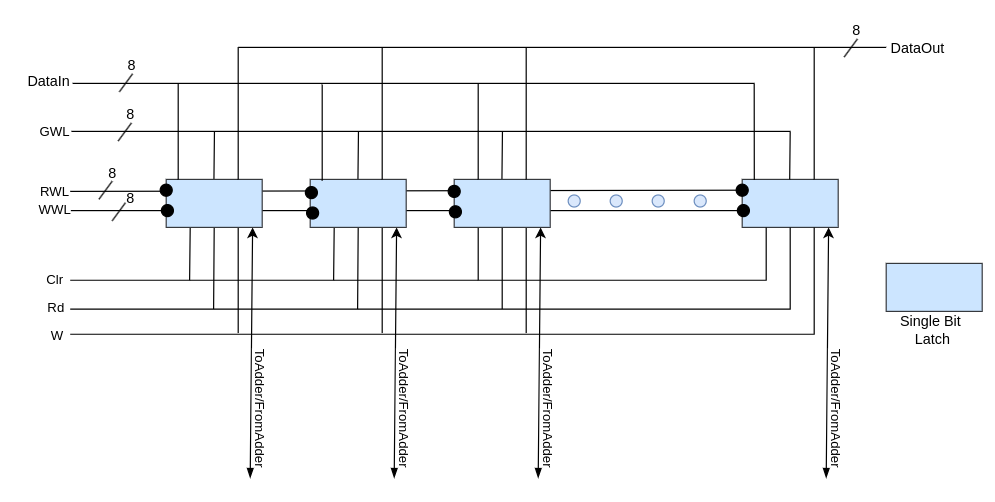

# CONV-ENGINE

## Table of Contents
- [Introduction](#introduction)
- [Memory Array](#memory-array)
- [Memory Vector](#memory-vector)
- [Memory Geometry](#memory-geometry)
- [Addition Operation](#addition-operation)
- [Multiplication Operation](#multiplication-operation)
- [File Description](#file-description)
- [User Guide](#user-guide)

## Introduction
The repository contains the RTL design for an advanced in-memory computing unit capable of performing parallel addition and multiplication directly within the memory. This design allows for efficient data-parallel operations by reducing the overhead of data movement between memory and processing units, a common limitation in traditional architectures. The current implementation supports loading two vectors into memory and executing arithmetic operations between them, such as addition and multiplication, in parallel. This architecture accelerates critical digital signal processing (DSP) operations like convolution, reduction/accumulation, dot product, matrix multiplication, and min/max pooling, which are essential components of deep neural networks (DNNs) and convolutional neural networks (CNNs).
## Memory Array

## Memory Vector

## Memory Geometry

## Addition Operation
<!-- Describe the implementation of the addition operation based on the Neural Cache. -->

## Multiplication Operation
<!-- Provide details on how the multiplication operation is carried out using the Neural Cache approach. -->

## File Description
<!-- List and describe the files in the project repository. -->

## User Guide
<!-- Instructions on how to set up and use the project, including running the Verilog simulation. -->

