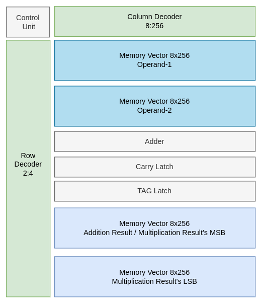
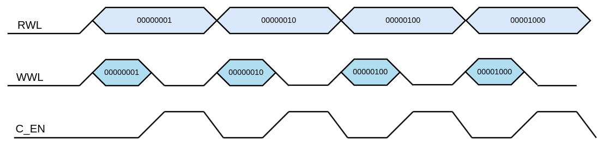

# CONV-ENGINE

## Table of Contents
- [Introduction](#introduction)
- [Memory Array](#memory-array)
- [Memory Vector](#memory-vector)
- [Memory Geometry](#memory-geometry)
- [Addition Operation](#addition-operation)
- [Multiplication Operation](#multiplication-operation)
- [File Description](#file-description)
- [User Guide](#user-guide)

## Introduction
The repository contains the RTL design for an advanced in-memory computing unit capable of performing parallel addition and multiplication directly within the memory. This design allows for efficient data-parallel operations by reducing the overhead of data movement between memory and processing units, a common limitation in traditional architectures. The current implementation supports loading two vectors into memory and executing arithmetic operations between them, such as addition and multiplication, in parallel. This architecture accelerates critical digital signal processing (DSP) operations like convolution, reduction/accumulation, dot product, matrix multiplication, and min/max pooling, which are essential components of deep neural networks (DNNs) and convolutional neural networks (CNNs).
## Memory Array
Single block of memory is able to store the 8-bits of data. Simple read and write operation can be performed using the `DataIn` and `DataOut` ports and `Rd/W` signals. In case of arithemetic operation a single bit has to be transmitted to adder via the `ToAdder`. The bit which is to be transmitted to the Adder is decided based on the `RWL[7:0]` signal. if `RWL[0] = HIGH` that means the value stored a the bit `0` is the memory block should appear on the `ToAdder`. Vice Versa from storing the value using the `FromAdder` and `WWL[7:0]` singals

## Memory Vector
A vector storage element can be formed using instantiating the Memory Array `n` times. Where `n` is the number of elements in the vector. vector size is fixed. A column decoder is used to read or write the data in an individual memory arrays.

## Memory Geometry

## Addition Operation

## Multiplication Operation

## File Description

## User Guide

